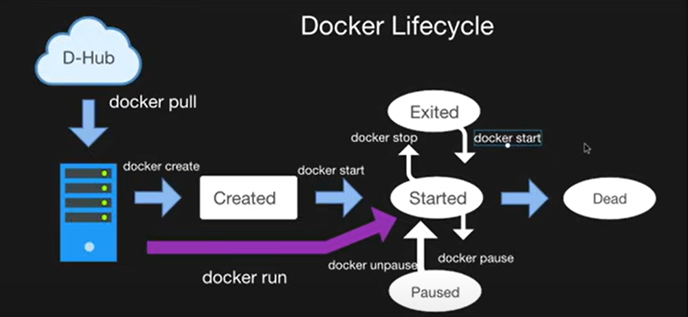

# Docker Fundamentals

## 1. Need of Docker
- Dependencies problems  
- Configuration issues  
- Environment settings  
- Microservices  

---

## 2. What is Docker?
- Builds, runs, ships  
- Uses containers  
- Multiple applications can run  
- Containers can be removed easily  
- No burden of application-related configuration on our systems  

---

## 3. VMs vs Containers

### Virtual Machines (VMs)
- Multiple isolated environments on the same host  
- Requires a copy of the host OS  
- Slower  
- Needs more resources (memory/CPU)  

### Containers
- Isolated environments  
- Lightweight compared to VMs  
- Faster as they share the same host OS  

---

## 4. Docker Architecture
- Client-Server model  
- The server is called the **Docker Engine**  

---

## 5. Docker Workflow
1. Code repository with a **Dockerfile**  
2. Dockerfile contains all the required dependencies  
3. Dockerfile → converted into **Docker Image**  
4. Docker Image contains everything required for a container to run  
5. Run a **Container** using the Image  
6. Once an image is generated, it can be registered to a **Docker Registry**  
7. Anyone can access these images and run them as containers  

---

## 6. Docker Life Cycle


## 7. Pull Hello-World Image from Docker Hub

```bash
docker pull hello-world
docker image ls 
docker run <image_id>
---